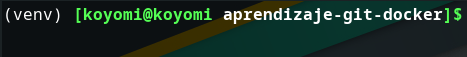

# Docker y git
## Objetivo general: 
Diseñar una aplicación backend utiliando github, docker, insomnia y python, la aplicación debe recoger información de la API https://pokeapi.co/.
## Objetivos específicos:
- Crear un dockerfile para definir los requerimientos del container.
- Crear una imagen de docker.
- Crear un repositorio en git.
- Conectar un repositorio de git con cuenta de github.
- Utilizar virtualenv para crear un environment con dependencias para la aplicación de python
- Hacer cambios en el proyecto principal y añadirlos al repositorio.
- Hacer pruebas del funcionamiento de la aplicación utilizando insomnia.
- Hacer una nueva rama (rama-prueba) y hacer cambios en la rama.
- Hacer un merge para combinar rama-prueba con la rama master.
- Documentar todo el proceso en el readme.md.
# virtualenv
Los ambientes virtuales en python, permiten instalar dependencias específicas del proyecto, para que las aplicaciones creadas utilicen librerías locales específicas. virtualenv permite trabajar en un ambiente virtual en el que solo existen las librerías instaladas dentro del ambiente virtual
## creación del ambiente virtual en python
- `$pip install virtualenv`: virtualenv permite administrar librerías específicas para la aplicación.
- `$virtualenv venv`: en la carpeta de la aplicación, crea una carpeta venv para gestionar el ambiente de la aplicación.
-  `$source venv/bin/activate`: activa el ambiente virtual.

    La terminal indica que está en el ambiente virtual con (venv): 
    
- `$pip list`: comando de pip que permite ver los paquetes instalados.
- Una vez en el ambiente virtual, se instalan paquetes utilizando `$pip install package-name`
- `$pip freeze --local` muestra una lista de los requerimientos junto con las versiones.
- `$pip freeze --local > requirements.txt`: exporta todos los nombres de paquetes y versiones a requirements.txt
- `$pip list`: comando de pip que permite ver los paquetes instalados.
- `$deactivate`: para salir del ambiente virtual.
- `$rm -rf venv`: elimina el ambiente virtual.
- configurar jupyter notebook para correr en un ambiente virtual (dentro del ambiente virtual): https://stackoverflow.com/questions/42449814/running-jupyter-notebook-in-a-virtualenv-installed-sklearn-module-not-available
    - `pip install ipykernel`
    - `python -m ipykernel install --user --name=my-virtualenv-name`
- `$jupyter-kernelspec uninstall venv`: desinstala el ambiente virtual del kernel

# Git y github
Git es un sistema de control de versiones, es decir, un software que permite guardar las versiones anteriores del código, generar versiones alternativas del código en nuevas "ramas", combinar diferentes ramas para integrar funcionalidades presentes en ramas de prueba a ramas principales, deshacer cambios volviendo a versiones anteriores, etc.
## Flujo de trabajo de git:

|etapa|comando|observación|
--------|-----|------|
|untraked|`$git init`, no add o `$git reset archivo`|archivos que no se añaden en nuevos commit|
|tracked (staging area)|`$git add filename` o `$git add .`|archivo añadido para un commit|
|averiguar estado de archivos|`git status`|untracked, tracked pero modified, commited|
|commited|`$git commit -m "mensaje"`|una captura del código en el momento actual|
|add y commit|`$git commit -a -m "mensaje"`|`$git add .; $git commit -m "mensaje"`|
|último commit|`$git log`|información del último commit realizado|

 

- ## Comandos de configuración de github:
    - `$git config --list`: lista las configuraciones de git
    - `$git config --global user.name "nombre de usuario"`: cambia  el nombre en la configuración.
    - `$git config --global user.email "correoEjemplo@gmail.com"`: cambia el correo en la configuración global
- `$git init`: inicia un repositorio de git en la carpeta actual.
- `$git add .`: añade todos los archivos a la staging area de git (los cambios están listos para ser guardados) `$git add ./archivo` añade un archivo específico.
- `$git reset archivo`: envia un archivo de la etapa de tracked a untraked.
- ## .gitignore:
    -  Archivo que guarda los nombres de todos los archivos y carpetas dentro del repositorio que no necesitan se trackeados.
    - normalmente se colocan archivos con contraseñas, módulos instalados, etc.
- ## Conexión del repositorio a github:
    - `$git remote`: da información de repositorios remotos conectados al repositorio local.
    - `$git remote add origin https://github.com/AlexGCas/aprendizaje-git-docker.git`: añade el repositorio remoto al repositorio local.
    - `$git push -u origin master`: envía el código en el repositorio local al repositorio en github.
- ## merge:
    - Para hacer un merge, todos los cambios en el repositorio local deben ser guardados primero
        - `$git add .`
        - `$git commit -m "mensaje"`
    - Buscar los cambios en el repositorio remoto
        - `$git fetch`
    - combinar el repositorio remoto al local
        - `$git merge origin/master`

# Docker
Docker permite crear una imagen de la aplicación, esta imágen contiene todo lo que la aplicación necesita para ser ejecutada, sistema operativo, dependencias, código fuente, etc. Para que el contenedor tenga acceso al repositorio de git, el dockerfile debe estar al mismo nivel del repositorio.
## Creación del contenedor:
- instalación de docker en manjaro: https://linuxconfig.org/manjaro-linux-docker-installation.

- ### Dockerfile: 
    - El dockerfile es el molde para crear la imágen del contenedor.
    - El dockerfile funciona por un sistema de capas como se presenta en la tabla, la primera capa es un sistema operativo base, las siguientes capas.
    son caracteristicas que se van agregando a ese sistema operativo base.
    - La aplicación creada en un contenedor corre utilizando las librerías definidas en el dockerfile para la imágen, no las presentes en el sistema operativo del computador.

    |capa|descripción|comandos|
    :-----:|:---------|:------
    |parent image|sistema operativo base que puede o no tener librerías predefinidas|`FROM alpine:3.10`|
    |dependencies|requerimientos específicos de la aplicación. ej: librerías, versiones de node, python, etc.| `RUN apk add --no-cache python3-dev \ && pip3 install --upgrade pip`: instala python y pip.|
    |source code| el código de la aplicación|`WORKDIR /app`: crea un directorio de trabajo dentro del contenedor.   `COPY . .`: copia todo lo que está en la carpeta actual al workdir app   `RUN pip3 -- no-cache-dir install -r requirements.txt`: instala las dependencias del requirements.txt|
    |run commands| como correr el contenedor| `CMD ["python3", "./src/app.py"]`: especifica el comando para correr la aplicación.|
    
    **Nota**: `apk add` es el equivalente de alpine 3.10 a apt-get install en ubuntu y sirve para instalar paquetes, run hace que en al construir la imágen se corran comandos del sistema operativo (alpine en este caso).
    - `$docker build flask-app`: crea una imágen llamada  `flask-app` a partir del dockerfile.

 

- ### Image:
    - Archivo que se puede distribuir para crear un contenedor en cualquier computador.
    - Existen imagenes predeterminadas (***parent images*** ) con sistemas operativos y frameworks instalados como `node:17-alpine` o `ubuntu`, las ***parent images*** se pueden encontrar en https://hub.docker.com/.
    - `$docker run -it --publish 7000:4000 --detach flask-app`: crea el contenedor a paritr de la imagen, el puerto que expone el contenedor es el puerto 4000 y el puerto al que corresponde en el computador ese puerto 4000 es el puerto 7000, en modo interactivo y en modo detach, es decir, corre en segundo plano dejando libre la consola.
    
    - ***Parent images***  contienen un OS liviano y un environment.
    - Correr una imágen crea un contenedor con todas las especificaciones de la imagen.

- ### Container:
    - Servidor basado en la imagen.

- ### Comandos de docker:
    - `$docker pull image`: descarga una imagen de dockerhub
    - `$docker ps`: muestra una lista de todos los contenedores.
    - `$docker container ls`: lista los contenedores activos.
    - `docker stop containerId`: detiene un container activo.

## Referencias:
- Docker fireship: https://www.youtube.com/watch?v=gAkwW2tuIqE
- Docker networkchunk: https://www.youtube.com/watch?v=eGz9DS-aIeY
- Dependencias de python: https://www.youtube.com/watch?v=YENw-bNHZwg
- Filesystems markdown: https://stackoverflow.com/questions/19699059/representing-directory-file-structure-in-markdown-syntax
- Virtualenv python: https://www.youtube.com/watch?v=N5vscPTWKOk
- Docker fazt: https://www.youtube.com/watch?v=YENw-bNHZwg
- docker y flask: https://www.digitalocean.com/community/tutorials/how-to-build-and-deploy-a-flask-application-using-docker-on-ubuntu-18-04-es
- Combinar docker y git https://www.baeldung.com/ops/dockerfile-git-strategies
- Docker ADD: https://www.educative.io/edpresso/what-is-the-docker-add-command
- Git fireship
- Git cold steele: https://www.youtube.com/watch?v=USjZcfj8yxE
- Github cold steele: https://www.youtube.com/watch?v=nhNq2kIvi9s